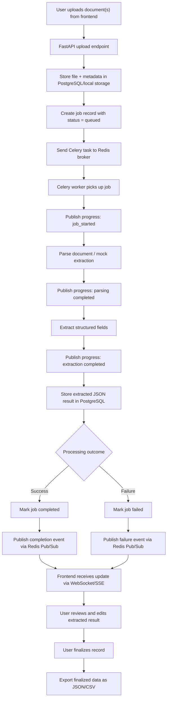

# Async Document Processing Workflow System

## 1. Project Overview

### Title
Build an Async Document Processing Workflow System

### Project Type
Full-stack application

### Goal
Build a production-style system where users can:

- upload one or more documents
- trigger asynchronous background processing
- track live or near-real-time progress
- review extracted structured output
- edit and finalize results
- export final output as JSON and CSV

### Core Constraint
Document processing must happen in background workers, not inside the request-response cycle.

---

## 2. Problem Statement

Organizations often receive documents such as invoices, resumes, contracts, purchase orders, or onboarding forms. Processing these documents manually is slow, error-prone, and hard to track at scale.

This project solves that by creating a workflow system that:

- accepts uploaded documents
- stores metadata and job records
- processes files asynchronously using Celery workers
- publishes progress events through Redis Pub/Sub
- shows job state updates in the frontend
- allows users to review and correct extracted data
- finalizes approved results for export

---

## 3. Business Need

Teams need visibility and reliability when documents take time to process. A synchronous upload API is not enough because:

- large files may take several seconds or minutes
- users need progress visibility
- failed jobs should be retried safely
- extracted data usually needs human review before final use

This system creates a realistic async workflow similar to enterprise document pipelines.

---

## 4. Objectives

### Primary Objectives

- build a clean full-stack application
- implement a real asynchronous processing architecture
- show progress updates while workers run
- separate upload, processing, review, finalization, and export
- provide a usable dashboard and detail page

### Secondary Objectives

- support retry for failed jobs
- support search, filter, and sorting
- keep the design extensible for OCR/AI integration later

---

## 5. Mandatory Technology Requirements

- Frontend: React or Next.js with TypeScript
- Backend: Python with FastAPI
- Database: PostgreSQL
- Background processing: Celery
- Messaging and state updates: Redis
- Progress updates: Redis Pub/Sub is mandatory
- Processing must not run inside API request handlers

---

## 6. Functional Requirements

### 6.1 Upload

The system must allow users to:

- upload one or more documents
- store file metadata such as filename, MIME type, size, upload time
- create a processing job for each uploaded document

### 6.2 Job Processing

Each document must trigger an asynchronous job that:

- starts in `queued`
- moves to `processing`
- completes as `completed` or ends as `failed`

### 6.3 Progress Tracking

The system must publish and display progress events such as:

- `job_queued`
- `job_started`
- `document_parsing_started`
- `document_parsing_completed`
- `field_extraction_started`
- `field_extraction_completed`
- `job_completed`
- `job_failed`

### 6.4 Review and Edit

After processing, the user must be able to:

- open a document detail page
- review extracted structured data
- edit fields manually
- save reviewed changes

### 6.5 Finalization

The user must be able to:

- mark a reviewed document as finalized
- lock the approved state logically for export

### 6.6 Retry

The system must:

- allow retry of failed jobs
- create a safe reprocessing flow

### 6.7 Export

The system must support export of finalized results as:

- JSON
- CSV

### 6.8 Dashboard

The dashboard must support:

- document listing
- search
- filter by status
- sorting
- progress visibility

---

## 7. Non-Functional Requirements

- responsive UI for desktop and mobile
- clear error handling
- maintainable service-layer architecture
- separation between API layer, business logic, worker logic, and persistence
- scalable enough to support multiple concurrent jobs
- idempotent retry behavior where possible
- clean API contracts with typed schemas

---

## 8. Recommended Real-World Scenario

### Scenario: Accounts Payable Invoice Processing

An operations team receives hundreds of vendor invoices every week. Staff upload invoice PDFs to the system. The backend extracts fields like:

- invoice number
- vendor name
- invoice date
- total amount
- tax amount
- currency
- payment status

Because invoices may be poorly formatted, extracted data is shown to a reviewer. The reviewer corrects mistakes, finalizes the record, and exports the data to accounting systems.

### Why This Scenario Fits Well

- realistic business use case
- structured fields are easy to mock or parse
- review/finalization makes clear business sense
- retry and failure handling are meaningful

### Other Valid Scenarios

- resume screening and candidate profile extraction
- insurance claim document intake
- contract metadata extraction
- KYC onboarding document processing

---

## 9. Proposed Solution

### High-Level Solution

1. User uploads one or more documents from the frontend.
2. FastAPI stores metadata and creates a job record in PostgreSQL.
3. FastAPI enqueues a Celery task.
4. Celery worker picks up the task and processes it in stages.
5. At every stage, the worker publishes progress events to Redis Pub/Sub.
6. Backend exposes these updates to the frontend using WebSocket or Server-Sent Events.
7. Frontend dashboard updates job status in near real time.
8. When processing completes, structured output is stored in PostgreSQL.
9. User reviews and edits the extracted result.
10. User finalizes the record.
11. Finalized data is exported as JSON or CSV.

---

## 10. Suggested Tech Stack

### Frontend

- Next.js 14+ with TypeScript
- Tailwind CSS for fast UI styling
- TanStack Query for API state management
- Native WebSocket or SSE client for progress updates
- React Hook Form for editable review forms

### Backend

- FastAPI
- Pydantic for schemas
- SQLAlchemy or SQLModel for ORM
- Alembic for migrations
- Uvicorn for local API serving

### Async Processing

- Celery for background jobs
- Redis as Celery broker
- Redis Pub/Sub for progress events

### Database

- PostgreSQL for document, job, and extracted-result storage

### Storage

- local file storage for assignment/demo
- optional abstraction for S3 or cloud object storage later

### DevOps / Bonus

- Docker Compose for local setup
- pytest for backend tests
- Playwright or Cypress for frontend tests

---

## 11. Proposed Architecture

### Main Components

- Frontend application
- FastAPI backend
- PostgreSQL database
- Redis broker and Pub/Sub
- Celery worker
- local file storage

### Layered Design

- API layer: upload, list, detail, retry, finalize, export, progress stream
- service layer: business rules and orchestration
- repository/data layer: database access
- worker layer: background processing stages
- realtime layer: Redis Pub/Sub to frontend stream

---

## 12. Flow Diagram

---

## 13. Detailed Processing Flow

### Suggested Worker Stages

1. document received
2. parsing started
3. parsing completed
4. extraction started
5. extraction completed
6. final result stored
7. job completed or failed

### Minimum Processing Logic

The assignment allows simple processing logic. A practical implementation can:

- read file metadata
- extract plain text from TXT/PDF or simulate parsed text
- generate structured fields:
  - title
  - category
  - summary
  - extracted keywords
  - status
- store final JSON output

Important: the system is evaluated more on workflow design than OCR or AI sophistication.

---

## 14. Suggested Data Model

### Table: `documents`

- `id`
- `original_filename`
- `stored_file_path`
- `mime_type`
- `file_size`
- `uploaded_at`
- `current_status`

### Table: `processing_jobs`

- `id`
- `document_id`
- `status` (`queued`, `processing`, `completed`, `failed`)
- `progress_percentage`
- `current_stage`
- `error_message`
- `retry_count`
- `created_at`
- `started_at`
- `completed_at`

### Table: `extracted_results`

- `id`
- `document_id`
- `raw_text`
- `structured_output_json`
- `reviewed_output_json`
- `is_finalized`
- `finalized_at`
- `updated_at`

### Optional Table: `job_events`

- `id`
- `job_id`
- `event_type`
- `payload_json`
- `created_at`

---

## 15. Suggested API Surface

### Upload and Jobs

- `POST /api/documents/upload`
- `GET /api/documents`
- `GET /api/documents/{id}`
- `GET /api/jobs/{id}`
- `POST /api/jobs/{id}/retry`

### Review and Finalization

- `PUT /api/documents/{id}/review`
- `POST /api/documents/{id}/finalize`

### Export

- `GET /api/documents/{id}/export/json`
- `GET /api/documents/{id}/export/csv`

### Progress

- `GET /api/jobs/{id}/events`
- `GET /api/jobs/{id}/stream`

---

## 16. Frontend Screens

### 1. Upload Screen

- file picker with multi-upload
- upload progress
- quick submission feedback

### 2. Dashboard

- list of all documents/jobs
- search by filename or category
- filter by status
- sort by upload date, status, filename
- live status badges and progress bars

### 3. Document Detail / Review Screen

- file metadata
- processing timeline
- extracted structured fields
- editable form for corrections
- save review button
- finalize button
- retry button if failed
- export actions if finalized

---

## 17. Real-World User Journey

### Example Journey: Invoice Review Officer

1. The officer uploads 25 invoice PDFs.
2. The system stores each file and creates 25 queued jobs.
3. Workers start processing jobs in background.
4. The dashboard shows statuses changing from queued to processing.
5. One invoice fails due to unreadable content and is marked failed.
6. Other invoices complete and show extracted vendor details.
7. The officer opens one completed invoice and corrects the total amount.
8. The officer finalizes the invoice.
9. The system exports the finalized invoice as JSON and CSV.
10. The failed invoice is retried after re-upload or correction.

### What Problem This Solves

- avoids blocking users during long processing
- gives visibility into each step
- supports human-in-the-loop review
- makes the workflow auditable and production-like

---

## 18. Error Handling Strategy

- mark invalid files early with validation errors
- capture worker exceptions and mark jobs as failed
- store error message for failed jobs
- allow retry for failed jobs
- publish failure events to frontend
- avoid duplicate finalization actions

---

## 19. Retry Strategy

Recommended retry behavior:

- only allow retry for `failed` jobs
- increment retry count
- reset progress and stage
- create a new Celery execution or reuse same job safely
- keep prior event history for visibility

Bonus improvement:

- enforce idempotency key or deterministic retry rules

---

## 20. Assumptions

- authentication is optional unless added as a bonus
- local file storage is acceptable for demo
- parsing logic can be mocked if async architecture is real
- progress can be near real time, not necessarily millisecond live
- export is only required for finalized records

---

## 21. Constraints

- must use Celery and Redis Pub/Sub
- must not process directly in request handlers
- UI can be simple but must be clear and usable
- strong architecture matters more than advanced AI/OCR

---

## 22. Evaluation Alignment

This solution directly addresses the evaluation criteria:

- correct async workflow
- proper Celery usage
- Redis Pub/Sub progress tracking
- backend API design
- frontend-backend integration
- database design
- retry and error handling
- readability and maintainability

---

## 23. Recommended Implementation Plan

### Phase 1

- set up FastAPI, PostgreSQL, Redis, Celery
- create database models
- implement upload and list APIs

### Phase 2

- implement Celery worker
- add document processing stages
- publish Redis progress events

### Phase 3

- build dashboard and detail page
- connect progress stream to frontend
- show statuses and progress bars

### Phase 4

- implement review, finalize, retry, and export
- add README, sample files, and demo assets

### Phase 5

- add Docker Compose
- add tests
- clean up code structure for submission

---

## 24. Final Recommendation

The strongest submission is not the one with the smartest extraction logic. It is the one with:

- a clean async architecture
- clear job lifecycle management
- reliable progress tracking
- thoughtful review and retry flow
- polished documentation and demo readiness

For this assignment, the best practical demo scenario is **invoice processing**, because it clearly shows upload, extraction, manual correction, finalization, and export in a business-friendly way.

