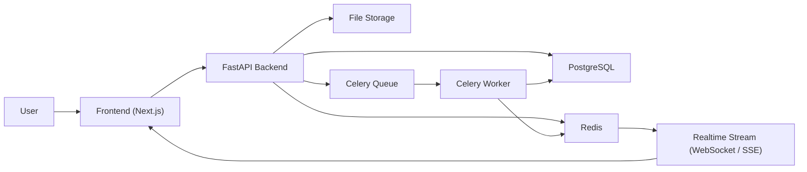
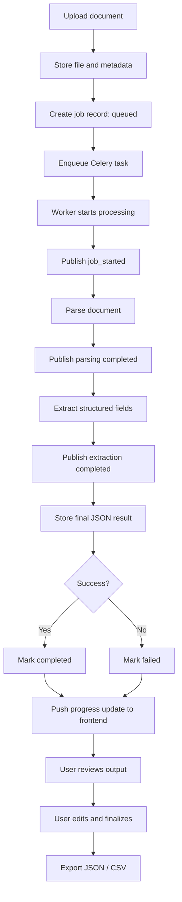
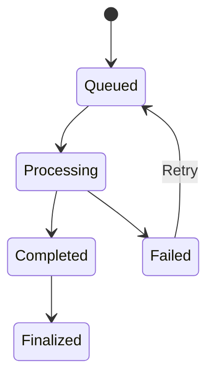

# Async Document Processing Workflow System

> A production-style full-stack system for uploading documents, processing them asynchronously, tracking progress in real time, reviewing extracted output, and exporting finalized results.

## Overview

This project is designed around a realistic document operations workflow. Users upload one or more files, the backend creates background jobs, Celery workers process the files asynchronously, Redis Pub/Sub streams progress updates, and the frontend allows users to review, edit, finalize, and export the result.

The focus is not advanced OCR or AI quality. The focus is strong system design, clean async execution, reliable progress tracking, and a practical human-in-the-loop review flow.

## Problem We Are Solving

Manual document handling is slow, repetitive, and hard to track. In real teams, documents such as invoices, resumes, contracts, or onboarding forms often need:

- upload and storage
- background processing
- status visibility
- human review
- retry on failure
- export after approval

This system solves that with a clean async architecture instead of doing heavy work inside API requests.

## Real-World Scenario

### Invoice Processing for an Operations Team

An accounts team receives dozens of vendor invoices every day. A reviewer uploads invoice PDFs into the system. Each invoice is processed in the background to extract fields such as:

- vendor name
- invoice number
- invoice date
- total amount
- tax amount
- currency
- status

Because extraction may not always be perfect, the reviewer checks the output, edits incorrect values, finalizes the document, and exports the approved result as JSON or CSV.

This scenario fits the assignment especially well because it demonstrates:

- asynchronous job execution
- progress tracking
- structured extraction
- manual correction
- final approval
- export workflow

## Key Requirements

- Frontend must use `React` or `Next.js` with `TypeScript`
- Backend must use `Python` with `FastAPI`
- Database must be `PostgreSQL`
- Background processing must use `Celery`
- Messaging and progress state must use `Redis`
- `Redis Pub/Sub` is mandatory for progress events
- processing must not run inside the request-response cycle

## Tech Stack

### Frontend

- `Next.js` with `TypeScript`
- `Tailwind CSS`
- `TanStack Query`
- `React Hook Form`
- `WebSocket` or `Server-Sent Events` for live updates

### Backend

- `FastAPI`
- `Pydantic`
- `SQLAlchemy` or `SQLModel`
- `Alembic`

### Async + Realtime

- `Celery`
- `Redis` as broker
- `Redis Pub/Sub` for progress events

### Data + Infra

- `PostgreSQL`
- local file storage for demo
- `Docker Compose` for local orchestration

## Core Features

- upload one or more documents
- create async processing jobs
- show job states: `Queued`, `Processing`, `Completed`, `Failed`
- publish live or near-real-time progress
- search, sort, and filter documents
- review extracted output
- edit and save reviewed output
- finalize approved records
- retry failed jobs
- export finalized output as `JSON` and `CSV`

## System Architecture

## Processing Flow

## Job Lifecycle

## Suggested Progress Events

- `job_queued`
- `job_started`
- `document_parsing_started`
- `document_parsing_completed`
- `field_extraction_started`
- `field_extraction_completed`
- `job_completed`
- `job_failed`

## Suggested API Surface

### Documents

- `POST /api/documents/upload`
- `GET /api/documents`
- `GET /api/documents/{id}`

### Jobs

- `GET /api/jobs/{id}`
- `POST /api/jobs/{id}/retry`
- `GET /api/jobs/{id}/events`
- `GET /api/jobs/{id}/stream`

### Review + Finalization

- `PUT /api/documents/{id}/review`
- `POST /api/documents/{id}/finalize`

### Export

- `GET /api/documents/{id}/export/json`
- `GET /api/documents/{id}/export/csv`

## Suggested Database Design

### `documents`

- `id`
- `original_filename`
- `stored_file_path`
- `mime_type`
- `file_size`
- `uploaded_at`
- `current_status`

### `processing_jobs`

- `id`
- `document_id`
- `status`
- `progress_percentage`
- `current_stage`
- `error_message`
- `retry_count`
- `created_at`
- `started_at`
- `completed_at`

### `extracted_results`

- `id`
- `document_id`
- `raw_text`
- `structured_output_json`
- `reviewed_output_json`
- `is_finalized`
- `finalized_at`
- `updated_at`

## Frontend Screens

- Upload screen for single or multiple documents
- Dashboard with search, filter, sort, and progress status
- Detail page for extracted output review
- Edit/finalize workflow page
- Export action for finalized records

## Example User Flow

1. A reviewer uploads 10 invoices.
2. The backend stores metadata and creates 10 queued jobs.
3. Celery workers process the files in the background.
4. Redis Pub/Sub emits progress updates.
5. The frontend dashboard shows live status changes.
6. One job fails and becomes retryable.
7. Completed jobs open in a review screen.
8. The reviewer corrects extracted fields.
9. The reviewer finalizes the approved result.
10. The system exports the final record as JSON or CSV.

## Clean Architecture Expectation

- API routes for upload, list, detail, retry, finalize, and export
- service layer for orchestration and business logic
- worker layer for async processing
- repository/data layer for persistence
- typed schemas / DTOs
- clear separation between sync API handling and async execution

## Error Handling and Retry

- invalid uploads should fail fast with clear validation errors
- worker exceptions should move the job to `Failed`
- failure details should be stored and visible
- failed jobs should support retry
- progress events should include failure states
- finalization should prevent accidental duplicate exports or inconsistent state

## Bonus Improvements

- Docker Compose setup
- automated tests
- authentication
- idempotent retry handling
- cancellation support
- storage abstraction for cloud object storage
- large-file edge-case handling

## Assumptions

- local file storage is acceptable for demo purposes
- parsing logic can be simple or mocked
- progress visibility can be near-real-time
- export is only required for finalized records
- authentication is optional unless explicitly added

## Evaluation Alignment

This design directly supports the expected evaluation areas:

- correctness of async workflow
- proper use of Celery
- correct Redis Pub/Sub integration
- backend API design
- frontend-backend integration
- database design
- progress tracking
- retry and error handling
- maintainable code structure
- engineering maturity

## Deliverables

- GitHub repository
- `README.md` with setup and architecture overview
- sample files for testing
- sample exported outputs
- short demo video
- note on AI tool usage if used during development

## Submission Notes

For the strongest submission, prioritize:

- a clean async pipeline
- visible job progress
- reliable retry behavior
- a simple but polished UI
- readable architecture and documentation

## Reference

The detailed requirement breakdown is available in [PROJECT_REQUIREMENTS.md](C:/Users/abhis/Downloads/internship/PROJECT_REQUIREMENTS.md).

